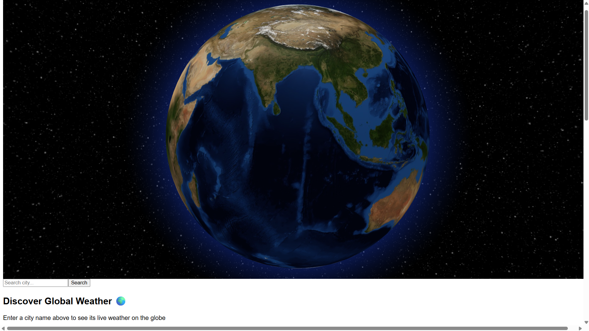
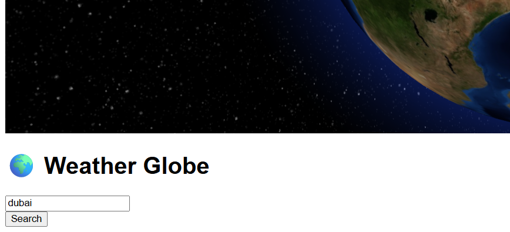

# 🌍 Weather Globe

An **interactive 3D weather visualization app** that combines real-time weather data with a rotating globe 🌐.  
Users can search for any city and see its **location highlighted on the globe**, along with **live weather details** displayed in a sleek interface.  

⚡ Currently **80% complete** → the core logic, search, globe animations, and weather data are functional.  
🎨 **20% pending** → UI/UX enhancements and polish.  

---

## 📖 Table of Contents
1. [Introduction](#-introduction)  
2. [Why This Project](#-why-this-project)  
3. [Features](#-features)  
4. [How It Works](#-how-it-works)  
5. [My Approach](#-my-approach)  
6. [Technologies Used](#-technologies-used)  
7. [Installation & Setup](#-installation--setup)  
8. [Screenshots & Preview](#-screenshots--preview)  
9. [Pending Enhancements](#-pending-enhancements)  
10. [Future Scope](#-future-scope)  

---

## 🚀 Introduction
Weather Globe is a **visual-first weather app** designed to make weather exploration engaging and interactive.  
Instead of plain text reports, users can **see the weather live on a 3D Earth**, creating a mix of utility and immersive experience.  

This project is designed as both a **tech challenge** and a **portfolio-ready showcase** of front-end, APIs, and interactive 3D graphics.  

---

## ❓ Why This Project
Most weather apps are flat and text-heavy.  
The goal here was to **reimagine weather apps**:  
- ✅ More engaging  
- ✅ Visually appealing  
- ✅ Educational & exploratory  
- ✅ Real-time + fun to use  

This app can be used in **education, personal productivity, or even as a futuristic dashboard widget**.  

---

## ✨ Features
- 🔎 **Search any city** → instantly zooms into its location on the globe.  
- 🌦️ **Real-time weather data** (temperature, wind speed, conditions).  
- 🌗 **Day/Night Earth textures** → switches based on time at location.  
- 🌌 **Particles + arcs** to visualize weather dynamics.  
- 🖥️ **Two-panel layout** → left = search & info, right = interactive globe.  
- 🔄 **Globe auto-rotates** when idle.  
- 📈 **Maximize/Minimize Globe** view for immersive exploration.  

---

## ⚙️ How It Works
1. **User enters a city name**.  
2. The app uses **Open-Meteo Geocoding API** to get latitude/longitude.  
3. Coordinates are sent to the **Open-Meteo Weather API** to fetch live weather data.  
4. The **globe (react-globe.gl)** smoothly animates to the location.  
5. A **marker and label** appear at the point, showing weather details.  
6. Optional effects → arcs, particles, background theme (day/night).  

---

## 🛠 My Approach
1. **UI/UX First** → Decided to center the app on the globe itself for maximum engagement.  
2. **Modular Components** → `App.jsx` handles state & API calls, `Earth.jsx` renders the 3D globe.  
3. **Performance Considerations** → async fetches, loading states, globe point-of-view transitions.  
4. **Scalability** → structured to easily add features like multi-city weather or forecasts.  

---

## 🧰 Technologies Used
- **React + Vite** → modern front-end setup.  
- **TailwindCSS** → fast, responsive, utility-first styling.  
- **react-globe.gl (Three.js under the hood)** → 3D interactive globe.  
- **Open-Meteo APIs** → free & fast weather + geocoding API.  
- **Framer Motion (planned)** → UI animation polish.  

---

## ⚡ Installation & Setup

Clone the repository:
```bash
git https://github.com/ASN07S/weather-now.git
cd weather-now
```

Install dependencies:
```bash
npm install
```

Run in development:
```bash
npm run dev
```

Build for production:
```bash
npm run build
```

---

## 🖼 Screenshots & Preview

### 🌐 Home Screen



### 📊 Weather Details on Globe



---

## 🎨 Pending Enhancements (20%)
- Refine the **UI for weather info** (floating cards on globe).  
- Add **better color schemes/icons** for different conditions.  
- Improve **responsiveness** for mobile/tablet.  
- Polish **animations** (smooth transitions, micro-interactions).  

---

## 🔮 Future Scope
- 🌍 **Multi-city comparison** → view multiple weather points.  
- 📅 **7-day forecast overlay**.  
- 🎤 **Voice-based search**.  
- 🛰️ **Satellite + radar layers** for advanced visuals.  
- 📱 **Mobile app version** (React Native).  

---

📌 **Status**: 80% completed ✅ | UI/UX polish remaining 🎨  
💡 This project demonstrates my skills in **React, APIs, 3D graphics, and UI/UX thinking**.  
